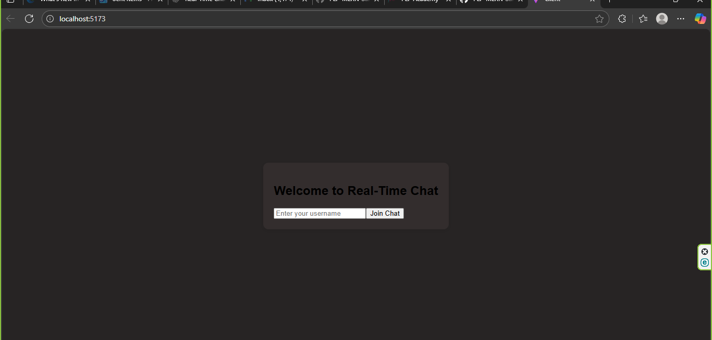

# 💬 Real-Time Chat Application (Week 5 MERN Assignment)

This project is a **real-time chat application** built with the **MERN stack** and **Socket.io**, demonstrating live bidirectional communication between multiple clients and the server.  
It allows users to chat in real time, see who’s online, get notifications, and enjoy a smooth, responsive experience.

---

## 🚀 Objectives

- Build a real-time communication app using **Socket.io**
- Implement **live chat**, **user status**, and **notifications**
- Demonstrate **bidirectional** and **event-driven** communication

---

## 🧱 Tech Stack

**Frontend:** React (Vite), Tailwind CSS  
**Backend:** Node.js, Express.js, MongoDB  
**Real-time Engine:** Socket.io  
**Authentication:** JWT (username-based)  
**Database:** MongoDB Atlas / Local MongoDB  
**Environment Management:** dotenv  
---

## ⚙️ Installation & Setup

### 🖥️ Server Setup
```bash
cd server
npm install
```

Create a `.env` file in the **server** directory:
```env
PORT=4000
MONGO_URI=mongodb://localhost:27017/chatapp
JWT_SECRET=se3f9b8a1a4d3c7f9b2cde6a4f7b9c3d4e5a6f708d9c1b2a3c4d5e6f7a8b9c0d1
CLIENT_ORIGIN=http://localhost:5173
```

Start the server:
```bash
npm start
```

### 💻 Client Setup
```bash
cd client
npm install
npm run dev
```

Then open [http://localhost:5173](http://localhost:5173) in your browser.

---

## 🧠 How It Works

1. The **server** handles all socket connections and broadcasts events.  
2. Each user joins a global room or a private room.  
3. Messages are emitted in real time and stored in MongoDB.  
4. Socket.io events handle:
   - `message`
   - `typing`
   - `user_connected`
   - `user_disconnected`

---

## 🖼️ Screenshot



---

## 👩‍💻 Author

**Name:** Anagwu Precious Chinemerem  
**Program:** PLP Academy – MERN Stack Specialization (Week 5)  
**Project:** Real-Time Chat Application with Socket.io  

---

## 🏁 License

This project is for educational purposes under the **PLP Academy Week 5 MERN Stack Assignment**.
