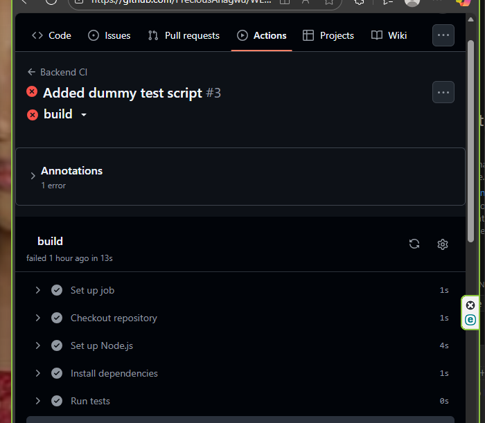

# MERN Deployment & DevOps Essentials

This project demonstrates how to deploy a full MERN Stack application with CI/CD pipelines, automated testing, linting, and monitoring.
It includes a React frontend and a Node.js/Express backend connected to MongoDB Atlas.

---

## 🌐 Deployment Links

Environment                     	URL
Frontend (Production)	         [[https://week-7-mern-deployment-assignment.vercel.app/]

Backend API (Production)	   [https://week-7-mern-deployment-assignment.onrender.com]
---

## 🧱 Tech Stack

**Frontend:** React (Vite), Tailwind CSS  
**Backend:** Node.js, Express.js, MongoDB  
**Real-time Engine:** Socket.io  
**Database:** MongoDB Atlas
**CI/CD:** GitHub Actions + Render Deploy Hooks
**Monitoring:** Render Logs + UptimeRobot  
---

## ⚙️ Installation & Setup

###   Clone the repository
```
git clone https://github.com/<your-username>/WEEK-7-MERN-deployment-assignment.git
cd WEEK-7-MERN-deployment-assignment
```

###   Setup the backend:
```
cd backend
npm install
npm run start
```

###   Setup the frontend:
```
cd client
npm install
npm run dev
```
###   Environment variables

Duplicate .env.example → .env in both backend/ and client/ directories, and fill in your values.

---

## 🧪 CI/CD Pipeline

1. Branch protection: Only tested code merges to main.

2. Continuous Integration (CI):

Runs linting and tests automatically.

Builds both frontend and backend on push.

3. Continuous Deployment (CD):

Auto-deploys to staging from develop branch.

Auto-deploys to production from main branch.

---

## 🖼️ Screenshot



---

##   📊 Monitoring Setup

Monitoring is configured using:

-   Render built-in logs (for backend crash/error monitoring)

-   UptimeRobot to ping the /healthz endpoint every 5 minutes

      -   Alert sent if downtime > 1 minute.

Example Health Check Endpoint
// backend/server.js
app.get('/healthz', (req, res) => {
  res.status(200).json({ status: 'OK', uptime: process.uptime() });
});

##   🔄 Rollback & Recovery

Option 1: Use Render Dashboard → revert to last successful deploy
Option 2: Git rollback

git revert <bad_commit_sha>
git push origin main

## 👩‍💻 Author

**Name:** Anagwu Precious Chinemerem 
**Email:**   panagwu@gmail.com
**Program:** PLP Academy – MERN Stack Specialization (Week 7)  

---

## 🏁 License

This project is for educational purposes under the **PLP Academy Week 7 MERN Stack Assignment**.
